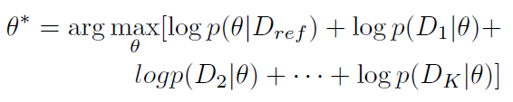
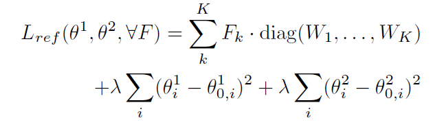
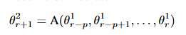
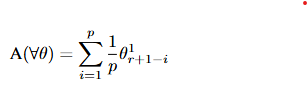
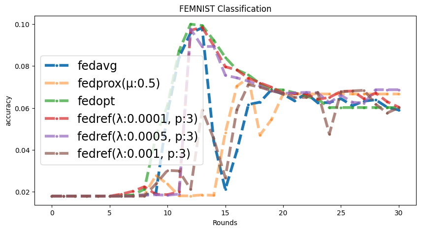
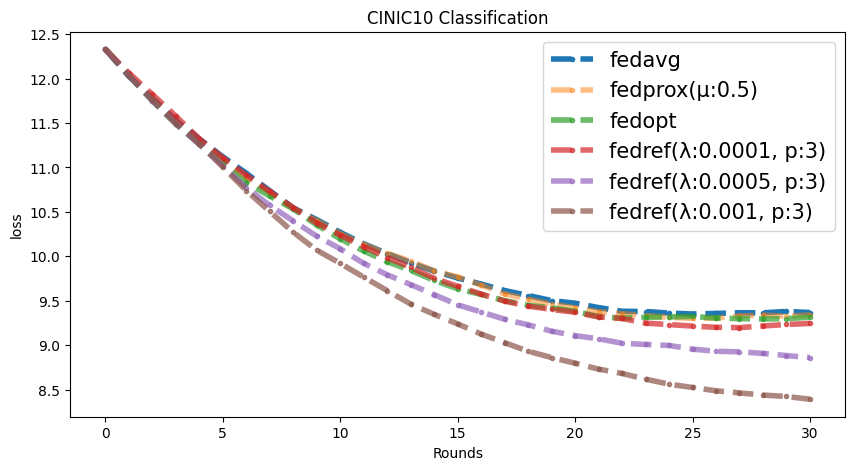
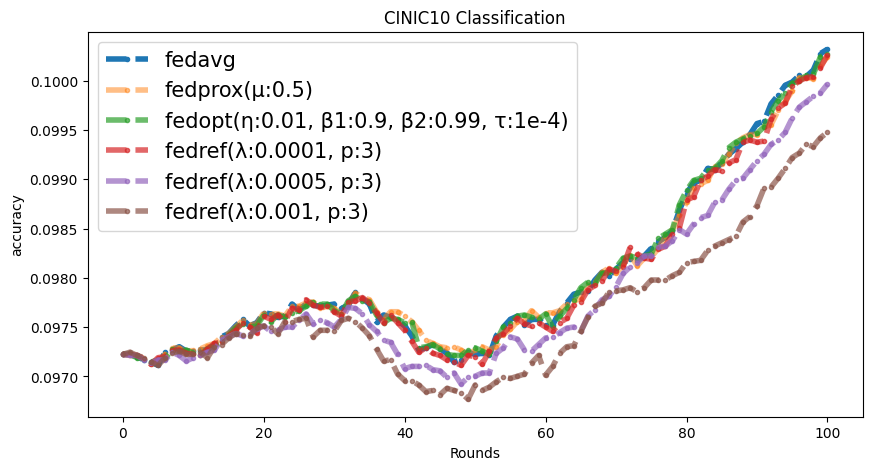
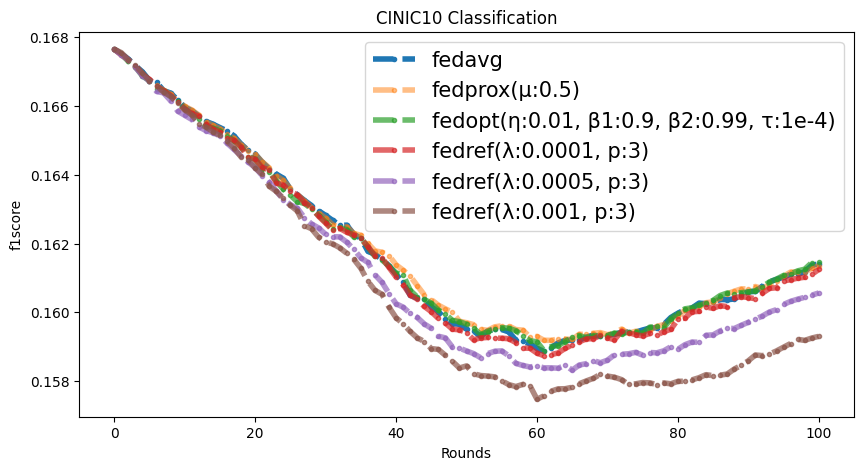
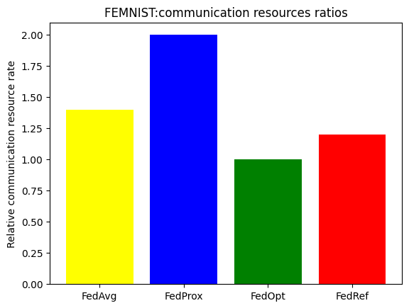
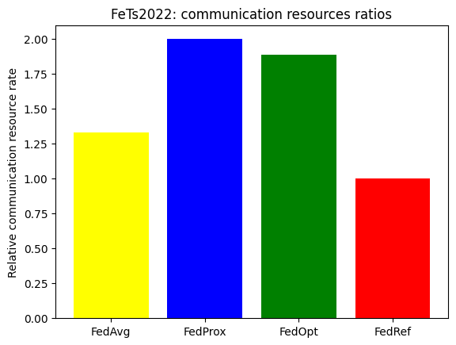

## Fed-Ref: Communication-Efficient Bayesian Fine Tuning with Reference Model

### Abstract
Federated learning (FL) collaboratively trains artificial intelligence (AI) models to ensure user data privacy. Sharing only model updates generated from local training on client data with the server enhances user data privacy. However, model performance may suffer due to data and system heterogeneity among clients in FL scenarios. Previous studies have proposed model optimization, fine-tuning, and personalization to achieve improved model performance. Despite these efforts, models resulting from FL scenarios often exhibit catastrophic forgetting, which increases the communication and computational costs of clients for model optimization and raises energy consumption. To address these challenges, we propose a reference model-based fine-tuning method for federated learning that overcomes catastrophic forgetting in each round. Our method is derived from Bayesian parameter-efficient transfer learning and includes an proximal term. It employs a reference model that incorporates previous model parameters and reviews previous global features in the model optimization step to mitigate catastrophic forgetting. As a result, our method achieves higher model performance and lower communication and computational costs for clients than existing methods.

Paper link: https://doi.org/10.48550/arXiv.2506.23210

### Introduction
Federated learning (FL) has recently been proposed as a promising solution to protect user data privacy while allowing collaborative model training between independent clients (devices or institutions) \cite{yang2019federated}\cite{lim2020federated}. User data are fundamentally protected because clients share only updated local model parameters (resulting from local training using local user data) and other non-private values with the server or other clients. The server then computes the global model by aggregating the local model updates received from the clients. However, as highlighted in \cite{fedavg}, FL approaches face numerous challenges, including:
    
    1. Optimization of predictive model performance.
    2. Decreasing computational costs and energy consumption. 
    3. Protecting the global model from malicious users and clients.

Our focus is on optimizing predictive model performance and reducing computational costs on client devices.

Above figure provides an overview of our proposed FedRef algorithm. The FedRef algorithm can be summarized in the following steps:
    1. Server sends a model to clients.
    2. Clients perform local training.
    3. Clients send a model parameter and cost value.
    4. Server aggregates selected clients parameters.
    5. Server computes a reference model.
    6. Server optimize global model derived from our Bayesian optimization using the reference model.
    7. Server send the result of the optimization to the clients.

 The existing studies have limitations of high client-side computational costs and catastrophic forgetting issues on each rounds. For optimal model performance and low client-side computational cost, we propose __FedRef__, a communication-efficient Bayesian fine-tuning method with a reference model that overcomes catastrophic forgetting by inferring from global models of previous rounds. 

### FedRef: Communication-Efficient Bayesian Fine Tuning with Reference Model

As illustrated in above figure, the reference model serves as a target model of proximal term objective reference to mitigate a deviation from previous round models. In the existing study \cite{bayesian}, transfer learning is a concept of model distillation and focus on how to distill and transfer features from alternative reference models to a target model. The most of FL scenario also focus on how do distillate to transfer features from each clients to global model. Therefore, in the most of FL scenarios, the ideal case assumes each client’s model inference is an independent event and when the model inference of all clients is, on average, the most accurate phase.

Selected client numbers $k \in [1,2,3,..,K]$, where $K$ is the total number of selected clients. $D_{ref}$: represents synthetic data of a reference model that incorporates features from previous rounds. $D_{ref}$ is defined solely for explaining our optimal MAP problem likes under equation. This concept enables overcoming catastrophic forgetting in each round by integrating previous round features into the MAP problem and then optimizing the integrated MAP value. Finally, the objective function can be expressed by combining equations to form under equation.

In the above equation, the constant value $\sum_{k}^{K} F_k$ denotes the sum of client losses. The diagonal matrix $\mathrm{diag}(W_1, \dots, W_K)$ represents aggregation weights (e.g. $\frac{n_i}{n}$). $\sum_{i} (\theta_i - \theta_{0,i})^2$ signifies $L_2$ regularization of model $\theta-\theta_0$. Regarding parameter requirements, only clients' losses are needed for our FedRef concept. Only on the server side, model optimization is performed, which can decrease client computing cost. In the FedRef, $\theta^2$ should be set as the reference model $\theta_{ref}$. For detail on $\theta_{ref}$, the reference model is defined as:

where $p$ is the number of selected subset of previous aggregation model which can be set heuristically and function $\text{A}$, which represents previous rounds global feature, is calculated as

Experimentally, a suitable value for $p$ was analyzed heuristically to be 3 to 5, but it should be considered about memory resources for saving parameters.

### Settings
| Environment set  | Settings for detail                             |
|------------------|-------------------------------------------------|
| FL framework     | Flower: a friendly federated learning framework |
| Language         | Python                                          |
| Operation System | Linux 24.04 LTS                                 |
| GPU              | Nvidia RTX 4090                                 |
| Tools            | Visual studio code                              |

### Conclusion
For optimizing model training in FL scenarios, existing studies have proposed various proximal terms that serve as regularization terms in the objective function, preventing local models from drifting too far from the global model. However, these approaches do not address the issue of catastrophic forgetting in each round, and their proximal terms have to be computed on the client side, increasing client-side computational costs. Our FedRef method, a communication-efficient Bayesian fine-tuning approach using a reference model, overcomes these limitations through server-side optimization of an objective function that includes a proximal term inferring previous global features. This approach leads to low client-side computational cost and high model optimization performance, thereby improving model training efficiency in federated learning settings.

### Results
FEMNIST

CINIC10

Communication Efficiency.

### Run

Available FL Strategies
1. FedAvg
2. FedProx
3. FedOpt
4. FedRef 
(our proposed work.)

! python main.py --version "AnyName" --type " fets|femnist|cinic10 " --seed "AnyNumber"--round "Round-Number" --epoch "LocalTrainingEpoch-Number" --batch-size "fets:1 |brats:1 | octdl:ProperNumber"--data-dir "TestData-Folder" --client-dir "Train-Client-Partitions-Folder" --lr "LearningRate" --mode "fedavg|fedprox|fedopt|fedref"--client-num "total number of clients" --gpu True| False --result-path "path" --prime "number of reference model" --lda "Bayesian aggregate learning rate"

for example:

    python main.py -v FedRefFEMNIST --data-dir None -cd None -r 30 -bs 256 -m "fedref" -t "femnist" --client-num 10 --epoch 3 --lr 0.000009 --lda 0.001 --prime 3

    python main.py -v FedRefFeTs --data-dir "folder1" -cd "folder2" -r 30 -bs 1 -m "fedref" -t "fets" --client-num 10 --epoch 3 --lr 0.000009 --lda 0.001 --prime 3