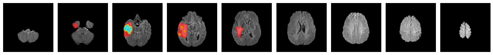
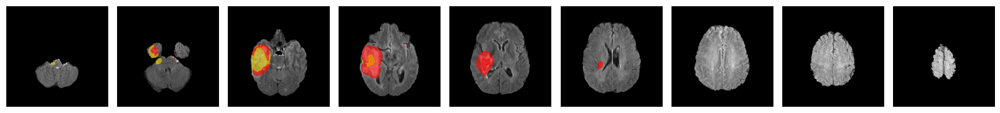
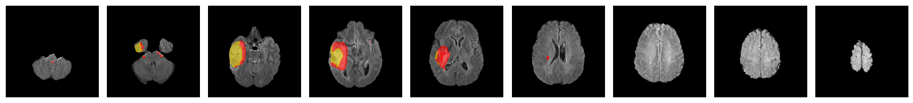
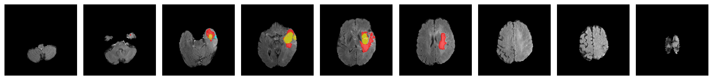
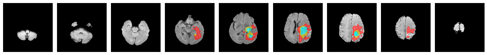
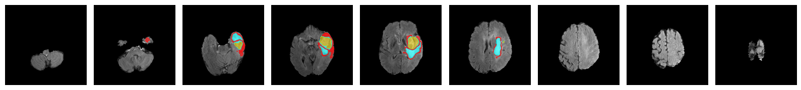
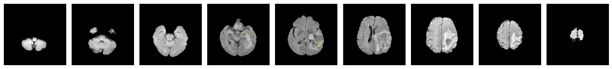
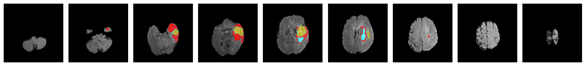

## Fed-Ref: Federated Learning on Reference Model for Medical Vision

### Abstract
Federated learning(FL) is proposed in the medical area as a solution to patient data privacy issues and in a decentralized state. However, existing FL scenarios have many challenges regarding model privacy, optimization of the aggregation method, and increasing model performance for a data heterogeneous scenario. In this paper, we focus on the heterogeneous issue and proposed federated learning based on knowledge distillation with the reference model(FedRef) for a clustered FL solution. This method guaranteed a standard model for clustering and aggregation model which can be controlled by the best model point by knowledge distillation method. For these reasons, FedRef improved the performance of the model under heterogeneous conditions.

### Settings
| Environment set  | Settings for detail                             |
|------------------|-------------------------------------------------|
| FL framework     | Flower: a friendly federated learning framework |
| Language         | Python                                          |
| Operation System | Linux 24.04 LTS                                 |
| GPU              | Nvidia RTX 4090                                 |
| Tools            | Visual studio code                              |

### Results
<table>
    <tr style="background-color:wheat;">
        <td>Segmentation</td>
        <td>Strategy</td>
        <td>mIoU</td>
        <td>Dice-score</td>
        <td>Hausdorff 95</td>
    </tr>
    <tr>
        <td rowspan=5 style="background-color:darkseagreen;">FeTs2022</td>
        <td>Centralized</td>
        <td>17.09%</td>
        <td>21.87%</td>
        <td>15.33</td>
    </tr>
    <tr>
        <td>Fed-Avg</td>
        <td>17.16%</td>
        <td>21.83%</td>
        <td>7.18</td>
    </tr>
    <tr>
        <td>Fed-PID</td>
        <td>17.10%</td>
        <td>21.75%</td>
        <td>6.73</td>
    </tr>
    <tr>
        <td>Fed-LWR</td>
        <td>17.35%</td>
        <td>22.01%</td>
        <td>6.92</td>
    </tr>
    <tr>
        <td>Fed-Ref</td>
        <td>17.28%</td>
        <td>21.94%</td>
        <td>7.12</td>
    </tr>
    <tr>
        <td rowspan=5 style="background-color:darkseagreen;">BRATS</td>
        <td>Centralized</td>
        <td>12.82%</td>
        <td>17.56%</td>
        <td>10.15</td>
    </tr>
    <tr>
        <td>Fed-Avg</td>
        <td>12.76%</td>
        <td>17.41%</td>
        <td>6.79</td>
    </tr>
    <tr>
        <td>Fed-PID</td>
        <td>12.58%</td>
        <td>17.18%</td>
        <td>5.20</td>
    </tr>
    <tr>
        <td>Fed-LWR</td>
        <td>12.74%</td>
        <td>17.38%</td>
        <td>6.69</td>
    </tr>
    <tr>
        <td>Fed-Ref</td>
        <td>12.77%</td>
        <td>17.42%</td>
        <td>6.81</td>
    </tr>
    <tr>
        <td rowspan=5 style="background-color:darkseagreen;">DRIVE</td>
        <td>Centralized</td>
        <td>17.18%</td>
        <td>29.33%</td>
        <td>23.18</td>
    </tr>
    <tr>
        <td>Fed-Avg</td>
        <td>00.00%</td>
        <td>00.00%</td>
        <td>0.0000</td>
    </tr>
    <tr>
        <td>Fed-PID</td>
        <td>00.00%</td>
        <td>00.00%</td>
        <td>00.00</td>
    </tr>
    <tr>
        <td>Fed-LWR</td>
        <td>00.00%</td>
        <td>00.00%</td>
        <td>00.00</td>
    </tr>
    <tr>
        <td>Fed-Ref</td>
        <td>00.00%</td>
        <td>00.00%</td>
        <td>0.0000</td>
    </tr>
    
</table>

### Result Visualization
#### FeTs2021
Label
Central
FedAvg
FedPID
FedLWR
FedRef

#### BRATS
Label
Central
FedAvg
FedPID
FedLWR
FedRef