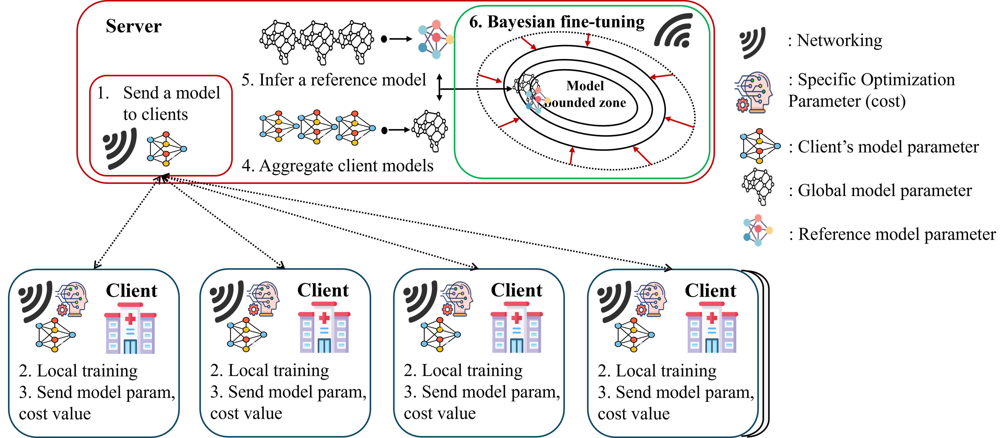
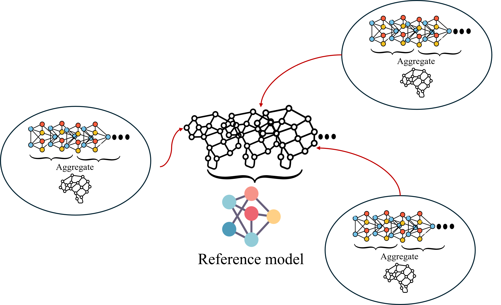
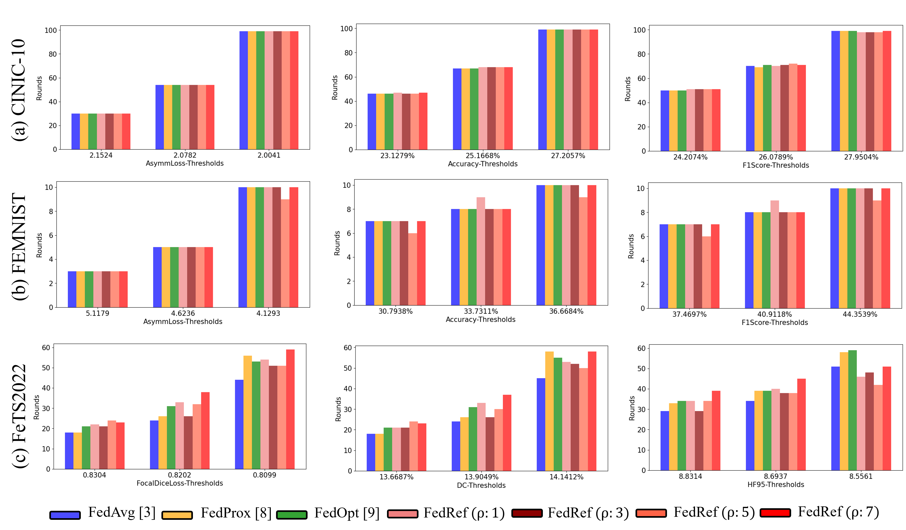
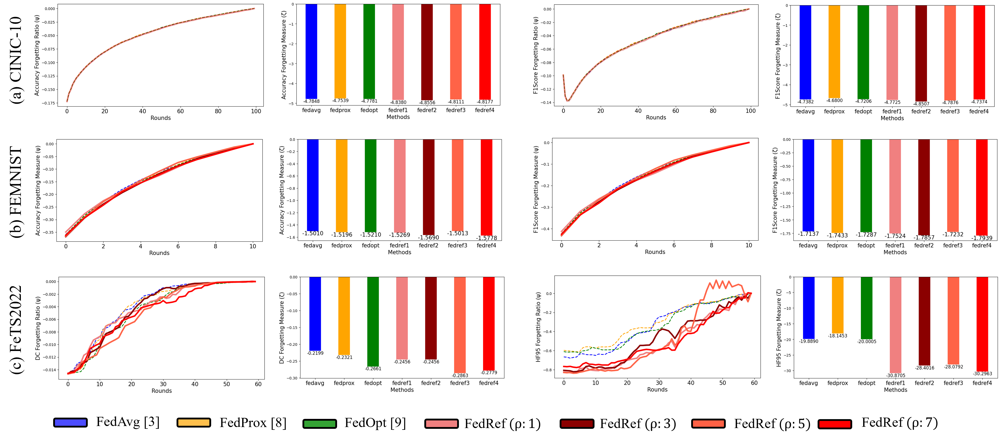

## Fed-Ref: Communication-Efficient Bayesian Fine Tuning with Reference Model

### Settings
| Environment set  | Settings for detail                             |
|------------------|-------------------------------------------------|
| FL framework     | Flower: a friendly federated learning framework |
| Language         | Python                                          |
| Operation System | Linux 24.04 LTS                                 |
| GPU              | Nvidia RTX 4090                                 |
| Tools            | Visual studio code                              |

### Result

Will be updated..
<!--  -->

<!--  -->

### Run

Available Dataset
1. cinic10
2. femnist
3. fets * need custom data settings following: 

        ├── Folder (parameter: -cd ./Folder)
            ├── client1
            ├── client2
            ├── client3
            ├── client4
            ├── client5
            ├── client6
            ├── client7
            ├── client8
            ├── client9
            ├── client10
            ├── client11
            ├── client12
            ├── client13
            ├── client14
            ├── client15
            ├── client16
            ├── client17
            └── test1 (parameter: --data-dir ./Folder/test1)
    

Available FL Strategies
1. FedAvg
2. FedProx
3. FedOpt
4. FedRef 
(our proposed work.)

For example:

python main.py -v FedRefFEMNIST --data-dir None -cd None -r 30 -bs 256 -m "fedref" -t "cinic10" --client-num 10 --epoch 3 --lr 0.000001 --lda1 0.001 --lda2 1e-6 --prime 3

python main.py -v FedRefFEMNIST --data-dir None -cd None -r 30 -bs 256 -m "fedref" -t "femnist" --client-num 10 --epoch 3 --lr 0.000001 --lda1 0.001 --lda2 1e-6 --prime 3

python main.py -v FedRefFeTs --data-dir "folder1" -cd "folder2" -r 30 -bs 1 -m "fedref" -t "fets" --client-num 10 --epoch 3 --lr 0.000001 --lda1 0.001 --lda2 1e-6 --prime 3