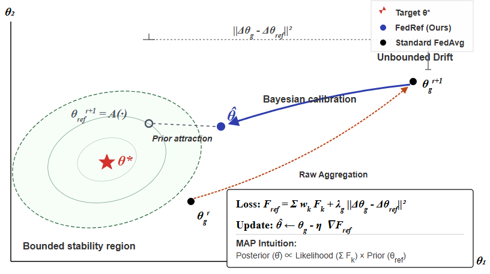

## Fed-Ref: Bayesian Fine Tuning Using a Reference Model to Alleviate Unbounded Drift for Heterogeneous Federated Learning

### Abstract

Federated learning (FL) enables collaborative model training across  distributed clients while preserving data privacy. However, data and system heterogeneity often cause unbounded drift in model updates caused from multiple local step, partial participation, unbounded dynamics, leading to degraded predictive performance and catastrophic forgetting and inefficient client computation. To address these challenges, we propose FedRef, a Bayesian fine-tuning method that leverages a reference model generalized from previous global models. FedRef integrates a MAP-based regularization term that calibrates global model updates toward a temporally aggregated reference model, thereby alleviating unbounded drift and improving update stability. Unlike prior approaches, FedRef performs all fine‑tuning operations on the server side, reducing client-side computational overhead while maintaining effective global optimization. Experiments on image classification (FEMNIST, CINIC‑10) and medical image segmentation (FeTS2022) demonstrate that FedRef achieves superior predictive performance and faster convergence under heterogeneous, non‑IID, unbounded drift settings, while preserving client-side computation compared with existing methods. These results highlight FedRef as an efficient and robust optimization framework for heterogeneous real-world FL scenarios.

### Overview of our proposed FedRef system 

### Bayesian-Fine Tuning Using a Reference Model 

### Settings
| Environment set  | Settings for detail                             |
|------------------|-------------------------------------------------|
| FL framework     | Flower: a friendly federated learning framework |
| Language         | Python: 3.9.21                                  |
| Operation System | Linux 24.04 LTS                                 |
| GPU              | Nvidia RTX 4090                                 |
| Tools            | Visual studio code                              |

### Result

Will be updated..

### Run

Available Dataset
1. cinic10
2. femnist
3. fets * need custom data settings following: 

        ├── Folder (parameter: -cd ./Folder)
            ├── client1
            ├── client2
            ├── client3
            ├── client4
            ├── client5
            ├── client6
            ├── client7
            ├── client8
            ├── client9
            ├── client10
            ├── client11
            ├── client12
            ├── client13
            ├── client14
            ├── client15
            ├── client16
            ├── client17
            └── test1 (parameter: --data-dir ./Folder/test1)
    

Available FL Strategies
1. FedAvg
2. FedProx
3. FedOpt
4. FedRef (our proposed work.)
5. Adabest (will be Update...)
6. FedEve (will be Update...)

For example:

    python main.py -v FedRefFEMNIST --data-dir None -cd None -r 30 -bs 256 -m "fedref" -t "cinic10" --client-num 10 --epoch 3 --lr 1e-6 --lda1 0.001 --prime 3 --degrade 0.0

    python main.py -v FedRefFEMNIST --data-dir None -cd None -r 30 -bs 256 -m "fedref" -t "femnist" --client-num 10 --epoch 3 --lr 1e-6 --lda1 0.001 --prime 3 --degrade 0.0

    python main.py -v FedRefFeTs --data-dir "folder1" -cd "folder2" -r 30 -bs 1 -m "fedref" -t "fets" --client-num 10 --epoch 3 --lr 1e-3 --lda1 0.001 --prime 3 --degrade 0.0