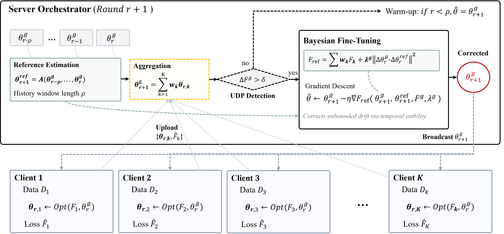
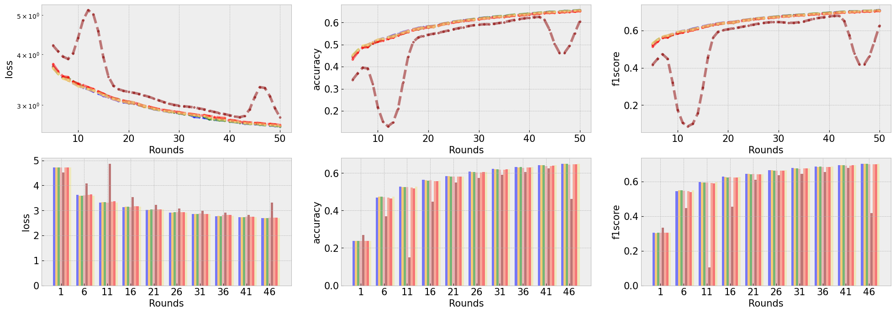
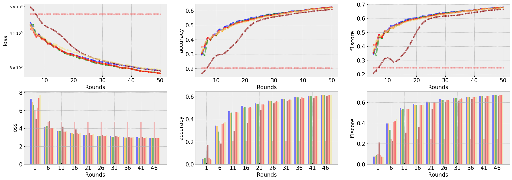
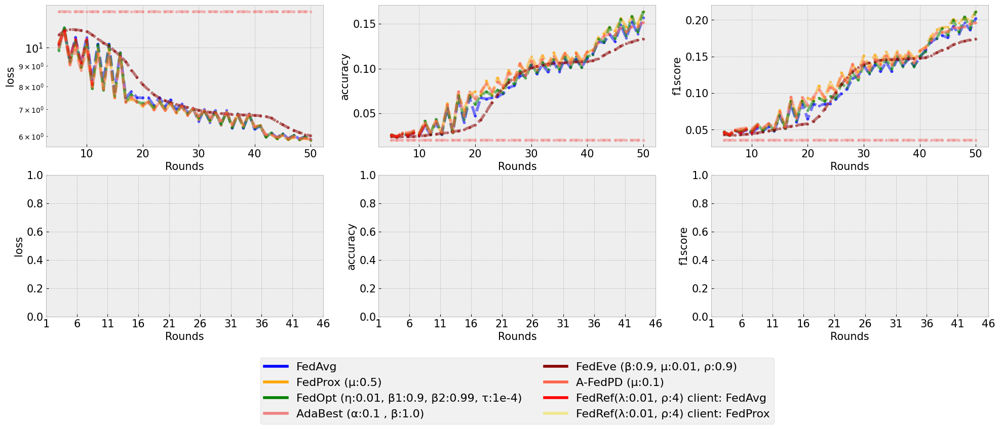

## Fed-Ref: Effective Unbounded Drift Control in Heterogeneous Federated Learning: Bayesian Fine-Tuning Using a Reference Model

### Abstract
Federated learning (FL) enables collaborative model training across distributed clients while preserving data privacy. However, data and system heterogeneity often induce unbounded drift in model updates due to each clients' different multiple local steps, partial participation, and unbounded dynamics in model updates. These challenges severely degrade predictive performance, exacerbate catastrophic forgetting, and hinder global optimization forward to optimal updates. Related works (AdaBest, FedEve, A-FedPD) defined dual drift problems and proposed each regularization term to client optimization process. However, in aspect of temporal unbounded drift, they generally reflect last round temporal drift to client optimization while forgets prior temporal unbounded drift. To address these limitations, we propose FedRef, a robust optimization framework that leverages a reference model generalized from prior global models via Bayesian fine-tuning. FedRef integrates a Maximum A Posteriori (MAP)-based regularization mechanism that calibrates global updates toward a temporally aggregated reference model, thereby effectively controlling unbounded drift and maximizing empirical stability.
Moreover, unlike prior approaches that rely on complex client-side optimization heuristics, FedRef achieves superior generalization to reflect recency weighting by seamlessly blending a robust probabilistic prior with global likelihood optimization. By maintaining a temporal moving average centered on previous global trajectories, the proposed framework provides a highly reliable optimization anchor that effectively counteracts misleading updates under extreme unbounded drift settings. Extensive experiments on image classification (FEMNIST, CINIC-10) and medical image segmentation (FeTS2022) demonstrate that FedRef yields superior predictive performance, and higher F1-scores, even under severe non-IID conditions. These results highlight FedRef as an exceptionally efficient and stable framework to address unbounded drift in model updates and achieve high-fidelity generalization including prior round global models' available information in heterogeneous real-world FL scenarios.

### Overview of our proposed FedRef system 

### Settings
| Environment set  | Settings for detail                             |
|------------------|-------------------------------------------------|
| FL framework     | Flower: a friendly federated learning framework |
| Language         | Python: 3.9.21                                  |
| Operation System | Linux 24.04 LTS                                 |
| GPU              | Nvidia RTX 4090                                 |
| Tools            | Visual studio code                              |

### Result

#### FEMNIST:
__Unbounded Drift Penalty 20%__

__Unbounded Drift Penalty 40%__

__Unbounded Drift Penalty 80%__

#### CINIC-10:
will be updated

#### FeTS2022:
will be updated

### Run

Available Dataset
1. cinic10
2. femnist
3. fets * need custom data settings following: 

        ├── Folder (parameter: -cd ./Folder)
            ├── client1
            ├── client2
            ├── client3
            ├── client4
            ├── client5
            ├── client6
            ├── client7
            ├── client8
            ├── client9
            ├── client10
            ├── client11
            ├── client12
            ├── client13
            ├── client14
            ├── client15
            ├── client16
            ├── client17
            └── test1 (parameter: --data-dir ./Folder/test1)
    

Available FL Strategies
1. FedAvg (fedavg)
2. FedProx (fedprox)
3. FedOpt (fedopt)
4. FedRef (our proposed work.)
5. Adabest (adabest)
6. FedEve (fedeve)
7. A-FedPD (afedpd)

For example:

    #FedAvg
    python3 main.py -r 50 -e 3 -bs 256 -l 1e-5 -udp -1 -t femnist -m fedavg -NON 10 -g --degrade 0.0 

    #FedProx
    python3 main.py -r 50 -e 3 -bs 256 -l 1e-5 -udp -1 -t femnist -m fedprox -NON 10 -g --degrade 0.0 

    #FedRef
    python3 main.py -r 50 -e 3 -bs 256 -l 1e-5 -udp -1 -t femnist -m fedref -NON 10 -g --degrade 0.0 --lda 1e-3 --prime 5