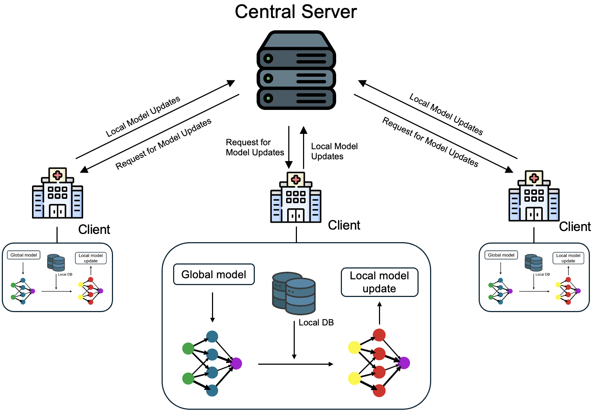

## Fed-Ref: Communication-Efficient Bayesian Fine Tuning with Reference Model

### Abstract
Federated learning(FL) is used for distributed scenarios to train artificial intelligence(AI) models while ensuring users' privacy. In federated learning scenario, the server generally never knows about users' data. This type of concept makes the AI training process efficient in terms of data privacy. However, about model performance, the federated AI model may not be sufficient to satisfy AI users' expectations. Moreover, there are many different needs to AI users. It is not easy to satisfy the whole users needs. This type of issues can be solved by AI model optimization and fine- tuning or personalization for optimal model performance. On the model optimization challenges, we proposed reference model-based federated learning for optimal fine-tuning overcoming catastrophic forgetting on each round. This method is derived in bayesian parameter-efficient transfer learning which include optimal proximal term and enable to overcome catastrophic forgetting issue on each round with reference model which include previous model parameters. As a result, this method achieve both of high model performance and low computing cost.

### Introduction
Recently, in the AI industry, federated learning (FL) has been proposed as a prominent solution to protect users' data privacy while allowing collaborative model training between independent affiliations. Users' data are fundamentally protected because not only the updated local model parameters, resulting from local training independently done by each client using its local data, but also other values are shared excepting privacy data with the server or other clients. The server then computes the global model by aggregating the local models received by the clients. But there are many challenges in FL solutions following:
    
    1. Model performance optimization in FL scenarios.
    2. Decreasing computing cost and energy consumption.
    3. How to protect the model from malicious users.

We focused on the model performance optimization and decreasing computing cost on client devices. In the related work section, we introduce the existing work about model optimization for FL scenarios and limitations of the clients' computing cost and catastrophic forgetting on each round. And then, we introduce our FedRef: communication-efficient Bayesian fine tuning with reference model concept.

### FedRef: Communication-Efficient Bayesian Fine Tuning with Reference Model
For optimal model performance and low client computing cost, we proposed FedRef: communication-efficient Bayesian fine tuning with reference model which overcome catastrophic forgetting by inferring of previous rounds model. Carefully we defined the model proximal term as a MAP problem for FL scenarios at equation derived in Bayesian fine tune paper.

$$\theta^{*} = \arg\max_{\theta} [\log p( \theta|D_{ref})+
\log p(D_1|\theta)+\nonumber\\ log p(D_2|\theta)+\dots + \log p(D_K|\theta)]$$

Selected client number $k = [1,2,3,..,K]$, $K$ : total number of selected client number. $D_{ref}$: synthetic data of reference model. We proposed reference model concept as a model integrated with previous rounds model parameters. This type of concept enable to overcoming catastrophic forgetting on each round by integrating previous round features to the MAP problem.
Finally objective function can be denoted by

$$
L_{ref}(\theta^1,\theta^2, \forall F)= \sum_{k}^{K} F_k \cdot \mathrm{diag}(W_1, \dots, W_K) \nonumber \\
        + \lambda \sum_{i} (\theta^1_i - \theta^1_{0,i})^2
        + \lambda \sum_{i} (\theta^2_i - \theta^2_{0,i})^2
$$

the constant value denoted $\sum_{k}^{K} F_k$: sum of clients' loss, The diagonal matrix $\mathrm{diag}(W_1, \dots, W_K)$ : aggregation weights (e.g. $\frac{n_i}{n}$), $\sum_{i} (\theta_i - \theta_{0,i})^2$ : $L_2$ regularization of model $\theta-\theta_0$. In terms of requirements of parameter, only clients' loss should be needed on our FedRef concept. And on only server side, performing as model optimization which can decrease the client computing cost and communication cost.

### Settings
| Environment set  | Settings for detail                             |
|------------------|-------------------------------------------------|
| FL framework     | Flower: a friendly federated learning framework |
| Language         | Python                                          |
| Operation System | Linux 24.04 LTS                                 |
| GPU              | Nvidia RTX 4090                                 |
| Tools            | Visual studio code                              |

### Results
